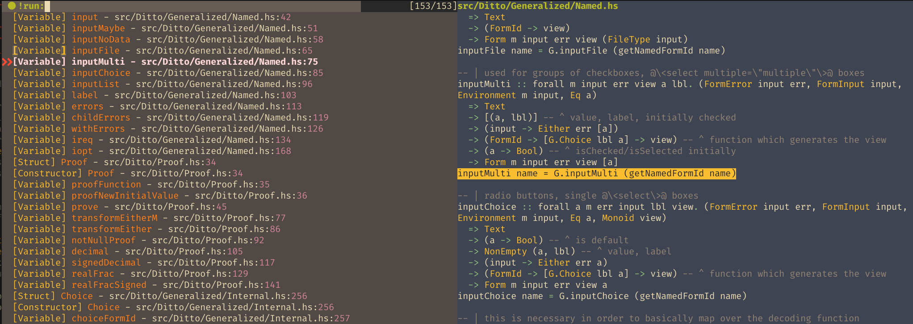

# nvim-clap-lsp

nvim lsp handlers a la [nvim-lsputils](https://github.com/RishabhRD/nvim-lsputils), but using [vim-clap](https://github.com/liuchengxu/vim-clap) as the UI

## example

```lua
vim.lsp.handlers['textDocument/documentSymbol'] = require'clap-lsp.symbols'.document_handler
vim.lsp.handlers['workspace/symbol']            = require'clap-lsp.symbols'.workspace_handler
```

## screenshots

